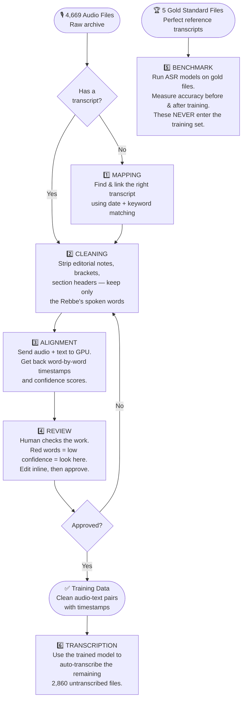
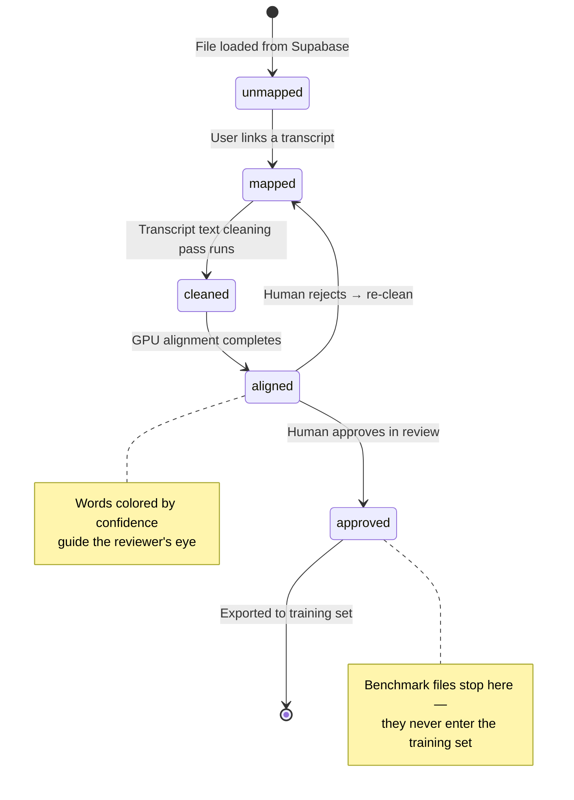

# JEM Yiddish ASR Workbench

> **What is this?** A browser-based tool that turns thousands of raw Yiddish audio recordings into clean, labeled training data for an AI speech recognition model — with no backend server required.

---

## The Big Picture

JEM (Jewish Educational Media) has thousands of recordings of the Lubavitcher Rebbe's talks (1950–1992). Most have never been transcribed. The goal: train an AI that can automatically transcribe Yiddish speech, then use it to make the entire archive searchable.

To train that AI, we need **50 hours of verified audio-text pairs**. This app is the workbench that produces them.

---

## Libraries

| ID | Name | Files | Notes |
|----|------|-------|-------|
| `jemedia` | JEM Media | 4,669 audio, 1,065 transcripts | Main archive — Rebbe's talks 1950–1992 |
| `satmar` | Satmar | 2 audio | Hoshana Rabba 5710, Va'eschanan Sharon Springs 5727 |
| `training` | Training | Growing | New audio for future training data |

Audio for `satmar` and `training` libraries uses the `r2.dev` URL (`pub-c3d984b0acf3415ab61d979b1a4d9665.r2.dev`) rather than `audio.kohnai.ai` — see gotcha below.

---

## The User Journey

Every audio file moves through a pipeline from raw → ready. Here's the full flow:



---

## Component Map

How the pieces connect:

```mermaid
graph LR
    subgraph Browser["🌐 Browser (your computer)"]
        UI[index.html\nThe single page]
        APP[app.js\nWires everything together]
        STATE[state.js\nAll data lives here\nlocalStorage + Supabase]
        DB[db.js\nSupabase client\nsync + load]
        TABLE[table.js\nThe main table view]
        MAP[mapping.js\nMatch audio ↔ transcript]
        CLEAN[cleaning.js\nStrip editorial noise]
        REV[review.js\nHuman verification panel]
        BENCH[benchmark.js\nWER/CER scoring]
        UTIL[utils.js\nShared helpers]
    end

    subgraph CF["☁️ Cloudflare (the cloud)"]
        PAGES[Cloudflare Pages\nHosts the app]
        W1[/api/align\nProxy Worker]
        W2[/api/audio\nProxy Worker]
        W3[/api/transcript\nProxy Worker]
        R2[(R2 Bucket\naudio.kohnai.ai\nAudio + transcript files)]
    end

    subgraph SB["🗄️ Supabase (JEM-ASR-Workbench)"]
        SBDB[(PostgreSQL\nxqivwkksimsvxsxhnzsj\nmappings, alignments,\nreviews, transcript_edits,\naudio_files, transcripts)]
    end

    subgraph GPU["⚡ GPU Server"]
        RUNPOD[align.kohnai.ai\nRunPod endpoint\nYiddish-tuned Whisper]
    end

    UI --> APP
    APP --> STATE
    APP --> DB
    STATE --> DB
    APP --> TABLE
    APP --> MAP
    APP --> CLEAN
    APP --> REV
    APP --> BENCH
    STATE --> UTIL
    MAP --> UTIL
    BENCH --> UTIL

    Browser --> CF
    DB --> SB
    W1 --> RUNPOD
    W2 --> R2
    W3 --> R2
```

---

## What Each Mode Does

### 1. Mapping — *"Which transcript goes with this recording?"*
The archive has 4,669 audio files and 1,065 transcripts. They weren't linked. The app compares Hebrew dates and content type in filenames to suggest matches — ranked by confidence. The reviewer clicks to confirm or uses the search modal to find manually.

Matching score (0–1.0):
- Exact year+month+day match → 1.0
- Year+month match → 0.5
- Year only → 0.25
- Content type keyword in both filenames → +0.15
- Transcript has firstLine text stored → +0.05 (prefers transcripts with richer metadata)
- firstLine contains matching content type keyword → +0.05

### 2. Cleaning — *"Strip the editor's notes, keep only the spoken words"*
Transcripts were prepared by human editors who added notes, section headers, and markers. Ten cleaning passes remove all of that:
- `[brackets]` → removed
- `(parenthetical notes)` → removed entirely (content and parentheses both stripped)
- Section markers like `סעיף א׳` and `* * *` → removed
- Surrounding quotation marks (Hebrew/English/French) → stripped
- **Dashes → space** (`cleanDashesToSpace`) — replaces all dash/hyphen chars with a space, preserving word separation ("word-word" → "word word"). Use this when you want the two words to stay separate and intelligible.
- Hyphens/dashes (em-dash, en-dash, multiples) → removed entirely (`cleanHyphens`) — use this when the dash is decorative and no space is needed
- Question mark artifacts (multiple `???`) → collapsed to single `?` (single `?` preserved)
- Ellipsis patterns (`...` and Unicode `…` U+2026) → removed
- Zero-width characters, smart quotes → normalized
- Extra whitespace and blank lines → collapsed

**Clean Rate** = what percentage of words survived. Below 50% means something looks wrong.

Note: "cleaned" is a pipeline status on an **audio file** — it means the transcript text linked to that audio has been cleaned and is ready for alignment. The cleaned text is stored in `transcript_edits` keyed by `audio_id`.

### 3. Alignment — *"Match each word to its exact timestamp in the audio"*
The cleaned text and audio are sent to a GPU server (RunPod) running a Yiddish-tuned Whisper model. It returns every word with a start time, end time, and confidence score. **Important:** The GPU scales to zero when idle — the first call can take ~2.5 minutes to warm up. The app retries automatically.

### 4. Review — *"A human checks the work"*
The review panel shows:
- A diff: original transcript vs. cleaned transcript (removed text in red)
- Every word as a colored chip — 🟢 green (confident), 🟠 orange (uncertain), 🔴 red (check this)
- Inline editing: click any word to fix it
- Approve / Reject / Skip buttons

### 5. Benchmark — *"Is the AI actually getting better?"*
Five gold-standard files with verified-perfect transcripts are used to measure model accuracy. The app runs them through any configured ASR model and calculates WER (Word Error Rate) and CER (Character Error Rate). **These files are permanently locked out of the training set.**

### 6. Transcription — *"Auto-transcribe the rest of the archive"*
Once the model is trained and benchmark scores look good, this mode sends the remaining 2,860 untranscribed audio files to the fine-tuned model for automatic transcription. The results go through the same review → approve pipeline.

---

## The Status Pipeline (one file's journey)



---

## Data & Storage

### Where data lives

| What | Where | Notes |
|------|-------|-------|
| Audio metadata (4,669 files) | Supabase `audio_files` | **Primary source** — loaded at startup |
| Transcript metadata (1,065 files) | Supabase `transcripts` | **Primary source** — loaded at startup |
| Full transcript text (50hr set) | Supabase `transcripts.text` | 227/228 50hr transcripts have full text stored |
| User work (mappings, cleaning, alignment, reviews) | Supabase + `localStorage` | Supabase is primary; localStorage is offline cache |
| Audio files | Cloudflare R2 (`audio.kohnai.ai`) | Proxied via `/api/audio` |
| Original transcript files | Cloudflare R2 (`audio.kohnai.ai/transcripts-txt/`) | Proxied via `/api/transcript` |

`public/data.json` is still present in the repo (used by the seed script) but the **app no longer loads it** — Supabase is the single source of truth for the catalog.

### Supabase database (JEM-ASR-Workbench)
- **Project ref:** `xqivwkksimsvxsxhnzsj`
- **URL:** `https://xqivwkksimsvxsxhnzsj.supabase.co`
- **RLS:** All tables have `public_read_write` policy (anon key has full access)

#### Tables

| Table | PK | Contents |
|-------|-----|---------|
| `audio_files` | `id` | All 4,669 audio files. Key columns: `is_selected_50hr`, `is_benchmark`, `r2_link`, `duration_minutes`, `comments`, `name_history` (JSONB rename trail) |
| `transcripts` | `id` | All 1,065 transcripts. Key columns: `first_line`, `r2_transcript_link`, `text` (full text for 50hr), `name_history` (JSONB rename trail) |
| `mappings` | `audio_id` | Audio → transcript links. Columns: `transcript_id`, `confidence`, `match_reason`, `confirmed_by`, `created_at` |
| `alignments` | `audio_id` | Word timestamps + confidence scores |
| `reviews` | `audio_id` | Approval status + `edited_text` (user's corrected text) + `reviewed_at` |
| `transcript_edits` | `(audio_id, version)` | Versioned transcript text. `version` is TEXT: `'cleaned'` (status tracking) or `'edited'` (the unified working version updated by both cleaning passes and manual edits). Columns: `text`, `original_text`, `clean_rate`, `created_at`, `created_by` |
| `segment_approvals` | `(audio_id, segment_hash)` | Persistent per-segment approval state. `segment_hash` is the space-joined word text of the segment. Approved state survives re-alignment as long as text is unchanged. |
| `asr_models` | `id` | ASR model configurations |
| `benchmark_results` | `id` | WER/CER benchmark run results |

#### Views

| View | Purpose |
|------|---------|
| `latest_edits` | Most recent edit per audio file |
| `audio_pipeline_status` | Each audio with `pipeline_status` (unmapped/mapped/cleaned/aligned/approved), `is_selected_50hr`, `is_benchmark`, `transcript_name`, `mapping_confidence` — use this in Supabase dashboard to monitor progress |

#### Name history tracking
Both `audio_files` and `transcripts` have a `name_history JSONB` column. A `BEFORE UPDATE` trigger automatically appends `{name, changed_at}` whenever a row's name changes, preserving the full rename trail.

#### 50hr collection flags
- `audio_files.is_selected_50hr = true` → 200 files, ~49.97 hours — equal distribution across all 40 years (5711–5752), ~75–80 min per year. Trimmed from original 420 files.
- `audio_files.is_benchmark = true` → 5 files (gold standard, never in training)

- **FK constraint:** `mappings`, `alignments`, `reviews`, `transcript_edits` all have FK → `audio_files.id`. `db.js` upserts the audio file row first before writing related rows (`ensureAudioFile()`).

### Startup flow (Supabase-only)
Both `app.js` (main table) and `detail.js` (per-file detail page) use the same Supabase startup flow:

1. Shows "Loading…" spinner
2. `loadFromSupabase()` fetches all tables in parallel — returns full `audio[]`, `transcripts[]` arrays plus work data (mappings, cleaning, alignments, reviews)
3. `initState({ audio, transcripts })` initializes state (also loads localStorage cache for offline work)
4. `mergeSupabaseData(remote)` overwrites localStorage cache with authoritative Supabase work data
5. `audioNames` localStorage overrides applied to `state.audio` entries so renamed files show correct names immediately
6. Page renders

**Every change:** `updateState()` saves to localStorage instantly, then calls `syncStateKey()` fire-and-forget to upsert the changed row in Supabase.

### Exporting your work
- **Export State** button → downloads a JSON file of all your work (mappings, cleaning, alignments, reviews)
- **Export CSV** button → downloads only the approved rows, ready for training
- Work is cloud-synced — moving computers just means opening the app

---

## The 5 Benchmark Files (locked forever)

These files have verified-perfect transcripts and are used only for measuring model quality:

```
0015--5711-Tamuz 12 Sicha 1.mp3
0142--5715-Tamuz 13d Sicha 3.mp3
2781--5741-Nissan 11e Mamar.mp3
0003--5711-Shvat 10c Mamar.mp3
2925--5742-Kislev 19 Sicha 1.mp3
```

The app enforces: no "Approve" button on these rows (both UI and `approveAll()` skip them), never included in training exports, always shown with a purple "Benchmark" badge. `is_benchmark=true` and `is_selected_50hr=false` in Supabase.

---

## Keyboard Shortcuts

| Key | What it does |
|-----|-------------|
| `↑` / `↓` | Highlight/select rows (does NOT open or navigate) |
| `Enter` | Expand/navigate the highlighted row (or approve if review panel is open) |
| `S` | Skip (decide later) |
| `R` | Reject (needs re-cleaning) |
| `E` | Toggle word edit mode |
| `Space` | Play / pause audio |
| `←` / `→` | Seek audio ±5 seconds |
| `/` | Jump to search box |
| `Escape` | Close any modal |
| `Ctrl+A` | Select all visible rows |
| `Ctrl+E` | Export state as JSON |
| `Ctrl+Shift+E` | Export approved rows as CSV |

---

## Success Looks Like

1. All 200 pairs in the 50-hour set: mapped → cleaned → aligned → reviewed → approved
2. Zero benchmark files in the training export
3. WER score drops after fine-tuning (e.g., Whisper baseline 45% → fine-tuned 18%)
4. The remaining 2,860 audio files transcribed automatically
5. Subtitle files generated for video playback

---

---
---

# Technical Reference (for developers)

---


## Known Gotchas

### Startup lazy loading — transcript text and alignment words NOT fetched at startup
`loadFromSupabase()` intentionally omits heavy fields:
- `transcripts` fetched without `text` column — full text loaded on demand in the detail page
- `alignments` fetched without `words` column — word array loaded on demand in the detail page

`loadAlignmentWords(audioId)` and `loadTranscriptText(transcriptId)` in `db.js` are the lazy loaders. `detail.js` calls these when opening a file. `detail.js` also has a shared `loadFullText(transcript)` helper that tries R2 first, then falls back to `loadTranscriptText` from `db.js`. `cleaning.js` `batchClean()` has its own `fetchTranscriptText()` that fetches R2 directly.

**Do not add `text` or `words` back to the startup queries** — it would fetch megabytes for 4,669 files on every page load.

**`alignment.words` is undefined at startup even when `alignment` is truthy.** The alignment object loaded at startup has `avgConfidence`, `lowConfidenceCount`, `alignedAt` but NOT `words`. Any code that reads `alignment.words` must use `alignment?.words ?? []` — never `alignment ? alignment.words : []`, which evaluates to `undefined` when the object exists but `.words` hasn't been lazy-loaded yet.

### Non-JEM library IDs break the `byId` sort
The startup sort in `db.js` originally used `parseInt(a.id.slice(2))` which assumed JEM-format IDs like `0016` (all-numeric). IDs like `satmar-001` slice to `tmar-001` → `NaN`, causing the sort to produce an empty-looking array and the app to show "Failed to load data." Fixed: `byId` now does `parseInt(a.id)` (full string) for numeric IDs, falling back to lexicographic comparison — so any library with non-numeric IDs works correctly.

### Default filter is 'fifty' — shows nothing in libraries with no 50hr files
`table.js` defaults `currentFilter = 'fifty'`, which only shows `is_selected_50hr = true` files. Libraries like `satmar` and `training` have no 50hr files, so the table appeared empty. Fixed in `app.js`: after loading, if `remote.audio.some(a => a.isSelected50hr)` is false, `renderTable` is called with `filter: 'all'`. JEM Media is unaffected (it has 200 50hr files).

### Transcript proxy uses filename-only by default — breaks for non-standard paths
`/api/transcript?name=` originally extracted just the filename from `r2TranscriptLink` and prepended `audio.kohnai.ai/transcripts-txt/`. For new libraries whose transcripts live at custom paths (e.g. `hoshana-5710/transcripts/transcript.txt`), this produces a wrong URL. Fixed: `loadFullText` in `detail.js` now passes `?name=<full-path>&domain=<host>` to the proxy. The proxy (`functions/api/transcript.js`) treats `name` as the full path when `domain` is explicitly provided, constructing `https://<domain>/<name>` directly.

### Audio player must route through /api/audio proxy — never set src directly
**Three places** set an audio element's `src` — all must proxy R2 URLs:
1. `detail.js` — main detail page player (`playerEl.src`)
2. `app.js` — inline expanded panel player (unmapped rows)
3. `table.js` `toggleInlinePlay()` — `new Audio(url)` inline play button

For JEM files on `audio.kohnai.ai` this accidentally worked because the browser could reach the URL, but for `r2.dev` URLs it fails with CORS errors. The src must always be `/api/audio?url=<encoded>` for any R2 URL. All three locations use `isLibraryR2Url(audioUrl)` to detect R2 URLs and proxy them.

`isLibraryR2Url()` in `auth.js` matches the library's configured `r2Domain` **and** any `*.r2.dev` hostname — both must be included since new library files use the public `r2.dev` URL.

### R2 custom domain (audio.kohnai.ai) only serves pre-existing objects
New objects uploaded to the `jem-asr-audio` R2 bucket via `wrangler r2 object put` do NOT appear at `audio.kohnai.ai` — they return 404 even though they exist in the bucket. The `r2.dev` public URL (`pub-c3d984b0acf3415ab61d979b1a4d9665.r2.dev`) works for all objects. New library audio files should use the `r2.dev` URL in their `r2_link` column. The `ALLOWED_R2_DOMAINS` Pages secret includes both domains: `audio.kohnai.ai,pub-c3d984b0acf3415ab61d979b1a4d9665.r2.dev`.

### db.js sync functions require library_id filters
`syncAudioField`, `syncAudioDuration`, `syncAudioTrim`, and `deleteMapping` all filter by both `id` **and** `library_id`. Without the `library_id` filter, an update on a shared-ID row could silently mutate data in a different library. Always include `.eq('library_id', getActiveLibrary() || 'jemedia')` alongside `.eq('id', audioId)` in any `UPDATE` or `DELETE` on `audio_files` or `mappings`. `getActiveLibrary` is imported at the top of `db.js`.

### Supabase row limit — use fetchAll(), not .limit()
`supabase.from(...).select(...).limit(10000)` does NOT work — Supabase's server-side `max_rows` caps responses at 1,000 rows regardless of the client-side `.limit()` call. All startup queries use `fetchAll(table, columns)` defined in `db.js`, which paginates in 1,000-row chunks via `.range(from, from+999)` until all records are returned. Never replace this with `.limit()`.

### Page layout: body is a flex column, table scrolls internally
`body` uses `display: flex; flex-direction: column; height: 100%`. The `.table-container` has `flex: 1; overflow: auto; min-height: 0` so it fills the remaining viewport height and scrolls internally. The `<thead>` is `position: sticky; top: 0` within that scroll container. The app header and filter bar are always visible above the table — they do not need `position: sticky`. Do not revert to a scrolling-page layout or the sticky column header will appear in the wrong position.

### Detail page layout: `.detail-page` needs `width: 100%`
`body` is `display: flex; flex-direction: column`. In a flex column container, `margin: 0 auto` on a child element **prevents stretch behavior** — the element shrinks to its natural content width instead of filling the container. `.detail-page` must have `width: 100%; box-sizing: border-box` alongside `max-width: 1200px; margin: 0 auto` so it spans the full viewport width on screens narrower than 1200px. Do not remove `width: 100%` from `.detail-page`.

### Cloudflare Pages — manual deploy required
The Pages project is NOT connected to GitHub auto-deploy. Every release requires:
```bash
npm run build
npx wrangler pages deploy dist/ --project-name jem-asr-app
```

### DB column: `duration_minutes` not `est_minutes`
Renamed via migration `20260323000000_rename_est_minutes.sql`. The DB column is `duration_minutes`, but the JS field on the audio object in state is **`estMinutes`** (set by `db.js` line: `estMinutes: a.duration_minutes`). Always use `audio.estMinutes` in JS code — never `audio.durationMinutes` (that field does not exist and silently returns `undefined`).

### Real audio duration auto-corrects via detail page
`audio_files.duration_minutes` was originally seeded from estimated values. When a detail page loads, the audio player's `loadedmetadata` event fires and gives the real duration. `detail.js` compares it against `audio.estMinutes` — if different, it calls `syncAudioDuration(audioId, realMin)` in `db.js` to update `audio_files.duration_minutes` in Supabase. The table Duration column self-corrects for any file once its detail page has been visited.

### DB column: `comments` on `audio_files`
Added via migration `20260323000001_add_audio_comments.sql`. Editable inline in the table; syncs to Supabase on blur via `updateState('audioComments', id, value)` → `syncAudioComment()`.

### Audio name edits sync to Supabase
Editing a name in the table or detail page calls `updateState('audioNames', id, newName)` → `syncStateKey` → `syncAudioField(audioId, 'name', value)` → `UPDATE audio_files SET name = ? WHERE id = ?`. The `name_history` trigger on `audio_files` automatically records the old name. `state.audio[n].name` is also updated in memory so filters/search reflect the change immediately.

**Important:** Always use state key `'audioNames'` (not `'renamedFiles'`). The detail page and table both use this key.

### Manual transcript tab is read-only
In `detail.js`, versions with `type === 'manual'` render the textarea with `readOnly = true` — no save handlers are attached, and a 🔒 badge is shown. A **"Start Editing"** button appears below the read-only area; clicking it fetches the full text (R2 → Supabase fallback), creates an `edited` version via `addVersion()`, and re-renders the detail page with that version active. This means every mapped file can immediately start editing without running cleaning tools first.

### Edited versions persist to Supabase
`edited` type versions are saved to the `transcript_edits` table (`version='edited'`) so they survive across browsers and sessions. Three sync points:
- `addVersion()` in `state.js` calls `syncEdited()` when `versionData.type === 'edited'`
- `updateVersion()` in `state.js` calls `syncEdited()` when `updates.text` changes on an edited version (covers the 800ms auto-save debounce in the textarea)
- `mergeSupabaseData()` in `state.js` restores edited versions from Supabase into `transcriptVersions` on startup — if a version already exists it updates its text, otherwise it creates a restored version entry

`syncEdited(audioId, text, audioEntry)` in `db.js` upserts to `transcript_edits` with `onConflict: 'audio_id,version'` — so there is always exactly one `edited` row per audio file (the latest edit). `loadFromSupabase()` extracts `version='edited'` rows into an `edited` key alongside `cleaning` and returns them to `mergeSupabaseData()`.

### Cleaning pass buttons are async
`getCurrentText()` in `detail.js` is async — it fetches the full transcript text from R2 or Supabase if no cleaning data exists yet (startup optimization means `transcript.text` is null). Pass buttons show "Loading…" while fetching, then open the diff preview. Always `await getCurrentText()` before running a pass.

### Diff view uses row-by-row display with character-level inline strikethrough
Cleaning pass diffs show two rows per changed line: the original line (`.diff-line-removed`) and the cleaned line (`.diff-line-added` — green, editable). This applies to both the cleaning pass preview modal and the detail page diff view.

**The original row uses character-level LCS diff** — only the specific removed characters (brackets, dashes, symbols, etc.) are wrapped in `.diff-char-removed` spans with `text-decoration: line-through`. Kept characters render as plain text nodes with no strikethrough. The `.diff-line-removed` container itself does NOT have `text-decoration: line-through` — the strikethrough is applied per-character only.

`buildInlineDiff(orig, clean)` in `detail.js` — LCS-based, returns `[{text, removed}]` segments. `renderInlineDiff(container, orig, clean)` — renders those segments into DOM (spans for removed, text nodes for kept). Both the preview modal and the word-view diff call `renderInlineDiff`.

### Rejected diff rows have visual feedback
`.diff-row-rejected` class sets `opacity: 0.38` and strikes through child text (including `.diff-line-removed` and `.diff-line-added`). Applied by checkbox `change` handler and the "Reject All" button. "Accept All" removes it from all rows.

### Audio playback speed controls
Speed buttons appear in two places, using the `.speed-btn` / `.word-view-speed-bar` CSS classes:
- **Main audio player** (detail page) — speeds: 1x, 1.25x, 1.5x, 2x.
- **Word view** (`renderWordView()` in `detail.js`) — speeds: 0.5x, 1x, 1.25x, 1.5x, 2x.

Both use a shared `renderSpeedBar(playerEl, speeds)` helper in `detail.js`. They set `audioElement.playbackRate` and toggle the `.active` class on the clicked button.

### Word view inline word editing (always-on, auto-save)
In `detail.js` `renderWordView()`, word chips are **always directly editable** — there is no "Edit Words" toggle or "Save Word Edits" button:
- Click any chip → opens inline `<input>`; Tab advances to next word; Enter/Escape commits/cancels; Delete on empty input deletes the word
- After every commit (word edit, delete, or insert), `scheduleAutoSave()` fires a 1.5s debounced `commitEdits()` that persists changes to state + Supabase
- A bulk RTL textarea below the chips shows all words space-joined; it auto-applies on blur (no button). Same-count edits preserve timestamps; different count redistributes timestamps evenly across the segment time range
- `commitEdits()` rebuilds the final word array from `editModeWords` + `insertions`, calls `updateState('alignments', ...)`, `setVersionAlignment()`, and `updateVersion(audioId, versionId, { text: newText })`
- `editMode` is a `const = true` — all chip rendering always uses edit affordances; do not add a mode toggle back

### Pipeline stepper and iterative cleaning workflow
`renderUnifiedWorkSection()` in `detail.js` renders all pipeline tools unconditionally (no step-gating):
1. **Pipeline stepper** — `renderPipelineStepper(step, iterCount)` shows Clean→Align→Review→Approve with green/active/gray states. `getPipelineStep(audioId)` derives the step from version data. Shows "Round N" badge when `getIterationCount() > 1`.
2. **Progress card** — `renderProgressCard(alignment)` shows % high-confidence words + color bar (green ≥80%, orange ≥50%, red <50%) when alignment exists.
3. **Cleaning section** — always visible (8 pass buttons + Clean All + ASR section).
4. **Align button** — always visible.
5. **Word view** — shown when alignment exists; dashed placeholder when not.
6. **Iteration History** — `renderIterationHistory()` renders a collapsible list of all aligned versions (v1, v2...) with confidence, date, `createdBy`. Each non-current row has "Compare with current" linking to `renderCompareView`.
7. **Approve bar** — `renderApproveBar(audioId, container)` standalone function (extracted from `renderWordView`); always shown below word view. Stores `approvedBy: getCurrentUser()` on approve.

**Iteration numbering:** Each version has an `iteration: number` field. `getNextIteration(audioId)` returns `max(iteration) + 1`. `batchClean()` bumps the iteration when re-cleaning after an alignment already exists. `migrateToVersions()` assigns `iteration: 1` to all legacy versions.

### User attribution
`src/auth.js` exports `getCurrentUser()` which returns the logged-in user's email (cached from `checkAuth()`). All user-initiated version creates use `createdBy: getCurrentUser()` instead of hardcoded `'user'`. Mapping uses `confirmedBy: getCurrentUser()`. The approve bar stores `approvedBy: getCurrentUser()` and displays "email on date".

### Word view export buttons (SRT / VTT / Karaoke HTML)
Three export buttons appear in the word view toolbar: **SRT**, **VTT**, and **🎤 Karaoke**.
- All three use the live word array: if "Edit Words" mode is active they export the in-progress edits (including deletions); otherwise they use the saved alignment words
- **SRT / VTT** call `generateSRT()` / `generateVTT()` from `utils.js` and `downloadFile()` — segments grouped on gap >0.5s or every ~10 words
- **🎤 Karaoke** calls `generateKaraokeHTML(words, audioSrc, title)` in `detail.js`, which produces a self-contained HTML file with:
  - Audio loaded from `https://jem-asr-app.pages.dev/api/audio?url=<encoded-r2-url>` (the open CF proxy — no auth required)
  - All word timestamps embedded as JSON
  - Dark-theme karaoke player: highlights the active word in blue, dims past words, click any word to seek
  - RTL layout for Yiddish text
- Downloaded as `<audio-name>-karaoke.html` — works offline in any browser

### Authentication — all pages require login
The app uses Supabase Auth (email + password). `src/auth.js` exports `checkAuth()`, `signIn()`, `signOut()`. Both `app.js` and `detail.js` call `await checkAuth()` at the very top of their `DOMContentLoaded` handler — this redirects to `/login.html` if there is no active session. `login.html` + `src/login.js` handle the login form. Supabase RLS on all tables requires the `authenticated` role (migration `20260324000000_require_auth.sql`); the anon key alone cannot read any data. To add a new user: POST to `/auth/v1/admin/users` with the service role key, then trigger `/auth/v1/recover` to send a password-reset email.

### Multi-tenancy — library-scoped access control
The app supports multiple independent libraries (datasets). Migration `20260331000000_add_multi_tenancy.sql` adds `libraries` and `library_members` tables and a `library_id` column to all 8 content tables (defaulting to `'jemedia'` for existing rows). RLS policies restrict each table to `library_id IN (SELECT public.user_library_ids())`.

**`src/auth.js`** exports four library context helpers:
- `getUserLibraries()` — fetches library memberships in **two separate queries** (first `library_members`, then `libraries` by IDs) rather than a single join. This avoids failures caused by PostgREST FK schema cache misses. Falls back to a hardcoded `jemedia` admin entry if the user has no rows in `library_members`. Returns `[{id, name, r2Domain, transcriptPathPrefix, audioPathPrefix, role}]`. Cached for the session.
- `getActiveLibrary()` — reads `localStorage['active-library']`, validated against cached memberships.
- `setActiveLibrary(id)` — writes to localStorage; the page reloads to switch context.
- `getActiveLibraryConfig()` — returns full config object for the active library.
- `isLibraryR2Url(url)` — returns true when the URL hostname matches the active library's `r2Domain`. Used in `alignment.js`, `benchmark.js`, `detail.js` instead of hardcoded `audio.kohnai.ai`.

**Startup flow** (both `app.js` and `detail.js`): call `getUserLibraries()` after `checkAuth()`. If empty → show "No library access" and return. Wire `<select id="library-selector">` in the header (hidden when user has only 1 library). Set page title to `${libraryName} ASR Workbench`.

**Data isolation:** `loadFromSupabase(libraryId)` passes the active library to every `fetchAll()` call as `.eq('library_id', libraryId)`. All sync/upsert helpers (`syncMapping`, `syncCleaning`, `syncEdited`, `syncAlignment`, `syncReview`, `toAudioRow`, `splitTranscript`, bulk helpers) include `library_id: getActiveLibrary()` in their payloads.

**localStorage keys:** `saveToStorage()` / `loadFromStorage()` use `asr-state-${libraryId}` instead of `jem-asr-state`. `initState()` runs a one-time migration: if `jem-asr-state` exists and active library is `jemedia`, it moves the data to `asr-state-jemedia` and removes the old key.

**To add a new library:** Use the Admin dashboard at `/admin.html` (Admin button visible in header for admin-role users). Libraries and members can also be managed via the Supabase dashboard directly.

**Workers SSRF allowlist:** `functions/api/audio.js` and `functions/api/align.js` read `context.env.ALLOWED_R2_DOMAINS` (comma-separated) to determine which R2 hostnames are allowed. Defaults to `audio.kohnai.ai` when unset. `functions/api/transcript.js` accepts an optional `?domain=` param validated against the same allowlist.

### Admin dashboard — library and member management
`admin.html` + `src/admin.js` — accessible at `/admin.html`. Protected: redirects to login if unauthenticated; shows "No admin access" if user has no `admin` role. The **Admin** link in the main app header is shown only when `libraries.some(l => l.role === 'admin')`.

**Libraries tab:** Lists all libraries the user administrates (ID, name, R2 domain, transcript path). Edit any field via a modal (updates `libraries` table). Create a new library via the `create_library()` SQL RPC — automatically adds the caller as admin.

**Members tab:** Pick a library → loads members via `get_library_members()` RPC (returns email + role, requires SECURITY DEFINER to read `auth.users`). Change role inline, remove member, or add by email via `add_library_member()` RPC.

**Upload tab:** Pick a library and file type (audio or transcript), select a file, optionally edit the display name and record ID, then click Upload. The flow is:
1. Browser `POST /api/upload` (multipart) with `Authorization: Bearer <supabase-jwt>`, `file`, and `key` (`{libraryId}/{filename}`)
2. Worker (`functions/api/upload.js`) verifies JWT against Supabase, uploads to `R2_BUCKET` binding, returns `{ url, key }`
3. Client inserts row into `audio_files` (or `transcripts`) in Supabase with the returned `r2.dev` URL
4. Success message shows the new record ID and a link to the file in R2

The upload endpoint requires three Cloudflare Pages secrets: `R2_BUCKET` binding (set in `wrangler.toml`), `SUPABASE_URL`, and `SUPABASE_ANON_KEY`. The Supabase secrets are already set via:
```bash
npx wrangler pages secret put SUPABASE_URL --project-name jem-asr-app
npx wrangler pages secret put SUPABASE_ANON_KEY --project-name jem-asr-app
```
Without `SUPABASE_URL`/`SUPABASE_ANON_KEY`, the JWT check is skipped (endpoint is open). The `R2_BUCKET` binding is declared in `wrangler.toml` and automatically available in production.

**SQL functions** (migration `20260331000001_admin_helpers.sql`, all `SECURITY DEFINER`):
- `create_library(p_id, p_name, p_r2_domain, p_transcript_prefix, p_audio_prefix)` — inserts library + adds caller as admin
- `add_library_member(p_library_id, p_email, p_role)` — looks up user by email, upserts membership, returns UUID
- `get_library_members(p_library_id)` — returns `(user_id, email, role, created_at)` for all members

`vite.config.js` has five entry points: `main` (index.html), `detail` (detail.html), `login` (login.html), `admin` (admin.html), `dashboard` (dashboard.html). If you add a new top-level HTML page you must add it here.

### Word view karaoke scroll only fires when word view is visible
The `timeupdate` handler in `renderWordView` calls `scrollIntoView` on the active word chip **only if** the word view container is currently in the viewport (`container.getBoundingClientRect()`). This prevents the top audio player from dragging the page down to the word chips while the user is viewing the player section.

### Segment auto-advance is disabled
The word view does NOT auto-advance to the next segment when the audio playhead passes the end of the current segment. The user must click **Approve Segment** (or use `‹`/`›`) to navigate. Do not re-add auto-advance — it was intentionally removed because users listen at 3x speed and the segment would jump before they finished.

Two places in `detail.js` were cleaned up to achieve this:
1. **`timeupdate` listener** — removed the block that called `goToSegment(next)` when `currentTime > segment.end`.
2. **Approve Segment button handler** — does NOT call `goToSegment(next)`. Only calls `updateStats()`, `updateSegHeader()`, re-renders sidebar, and syncs approval to DB.

### Persistent segment approvals
The **"Approve Segment"** button (formerly "Mark Reviewed") persists to the `segment_approvals` Supabase table. Key details:

- **Hash key:** `segHash(segIdx)` = `segments[segIdx].map(w => w.word).join(' ').trim()` — text-based, not index-based
- **Survives re-alignment** as long as segment words are unchanged (same hash)
- **Cleared by word edits** — editing a word changes the hash, so that segment needs re-approval
- **Loaded on page open** via `loadSegmentApprovals(audioId)` → `setSegmentApprovals(audioId, hashes)` in state
- **State store:** `state.segmentApprovals[audioId]` = `Set<string>` (runtime only, not in localStorage)
- **Toggle:** `toggleSegmentApproval(audioId, hash)` → returns new boolean → caller fires `syncSegmentApproval()` fire-and-forget
- Stats bar shows: Approved / Remaining / Progress / Problems (unapproved problem segments only)

### Problem segment filter
The **"⚠ Problems (N)"** button in the word view toolbar:
- Counts segments with **3+ consecutive low-confidence (< 0.4) words** (strict consecutive, not total count)
- When active: **hides** non-problem segments from the sidebar list entirely; ‹/› navigation skips to adjacent problem segments; automatically jumps to the first problem segment if current isn't one
- `isProblemSegment(segIdx)` in `detail.js` — returns true when any run of consecutive low-conf words reaches 3

### Segment pause is gated on word view visibility
The `timeupdate` handler pauses at the end of the current segment **only when the word view container is visible in the viewport**. This prevents the top audio player (above the fold) from being stopped mid-playback by the segment boundary. The check uses `container.getBoundingClientRect()` — the same pattern already used to gate karaoke scroll. Do not remove this viewport check or the top player will stop abruptly at segment ends.

### Trim slider drag requires `user-select: none`
`renderTrimControls` sets `document.body.style.userSelect = 'none'` on `mousedown` and clears it on `mouseup`. Without this, the browser treats the drag as text selection and interrupts it. Always restore `userSelect` in the `onEnd` handler.

### Mobile card view opens detail page
At ≤480px the table switches to card view (`buildCardView` in `table.js`). Each card has an **"Open"** button and the card itself is clickable — both navigate to `detail.html?id=<audioId>` **in the same tab**. Ctrl/Cmd+click opens in a new tab.

### Row click and keyboard behavior by status
Clicking a table row calls `onRowExpand(audioId, e)` in `app.js`, which dispatches based on status:
- `unmapped` → expands inline to show mapping suggestions + Search Transcripts button
- `mapped` / `cleaned` → navigates directly to `detail.html?id=` **in the same tab** (Ctrl/Cmd+click for new tab)
- `aligned` / `approved` → expands inline to show the review panel + Open Detail Page button
- `benchmark` → expands inline to show benchmark tools

**Arrow keys** (`↑`/`↓`) only highlight/select rows — they do NOT trigger expansion or navigation. Only `Enter` or a click expands/navigates.

The inline mapping bar (Linked to / Unlink / Change Transcript / Split Transcript) has been removed from all expanded panels — those controls are on the detail page.

### Filter, page, and search state in URL
`table.js` uses `history.replaceState` to keep `?filter=`, `?page=`, and `?q=` in sync with the current view. On init, these are read from `URLSearchParams` so a page refresh restores position. The detail page back button uses `history.back()` to return to the table preserving this state.

### Rejected file recovery
When a file is rejected in the review section, a **"Re-clean & Re-align"** button appears in the approve bar. Clicking it calls `updateState('reviews', audioId, null)` to clear the rejection and re-renders the detail page so the user can iterate.

### Library switch confirmation
`app.js` shows a `confirm()` dialog before calling `location.reload()` when the user switches libraries, to prevent accidental loss of unsaved offline work.

### Bulk clean button state
The bulk **Clean** button is disabled (with tooltip "Select rows first") when no rows are selected. After bulk clean, a summary dialog reports any per-file failures.

### Table column visibility handles compound filter keys
Column `showWhen` functions use `filterMatchesStatus(filter, statuses)` which extracts the status portion from compound keys like `'fifty-unmapped'` or `'50hr-mapped'`. This ensures columns like `firstLine` correctly show/hide when viewing 50hr sub-filters.

### Audio name inline editing stops propagation on the input
In `table.js` `case 'name'`, clicking the `nameSpan` replaces it with an `<input>` and calls `e.stopPropagation()`. The `<input>` itself also has a click handler calling `e.stopPropagation()` — without this, clicking inside the input to reposition the cursor would bubble to the `<tr>` click handler and trigger row navigation.

### Unified working version — cleaned and edited are the same tab
Cleaning passes and manual editing both update the **`edited`** version. There is no longer a separate "Cleaned" tab — the `cleaned` version type still exists internally for `getStatus()` pipeline tracking (so the file shows "cleaned" status in the table), but the `cleaned` tab is hidden in `renderMappingSection` whenever an `edited` version exists.

**Data flow:** `openPassPreviewModal` "Apply Selected" → updates `edited` (and syncs `cleaned` for status). `batchClean()` → same. Manual textarea edits → auto-save debounce → `syncEdited()`. All three paths write to the same `edited` version object and the same `transcript_edits` row (`version='edited'`). The next cleaning pass reads from `activeVersionRef.id` (which is `edited`), so passes chain correctly against the current working text.

The "Save Cleaned Text as Edited Version" button has been removed — it is no longer needed.

### Cleaning passes and alignment use the selected version tab's text
`renderDetailPage` creates a shared `activeVersionRef = { id }` object and passes it to both `renderMappingSection` and `renderUnifiedWorkSection`. Whenever the user clicks a version tab, `activeVersionRef.id` is updated. `getCurrentText()` in `renderUnifiedWorkSection` reads from the selected version's `.text` for non-manual versions, or falls back to loading the raw transcript from R2/Supabase for the manual version. The alignment button calls `getCurrentText()` and passes the result as `textOverride` to `alignRow(audioId, state, textOverride, currentVersionId)` — so alignment always runs on whatever version is currently displayed, and the result is stored on that specific version.

### Per-version alignment storage
Alignment data is stored both in the legacy flat `state.alignments[audioId]` key (for backward compat) AND on the individual version object as `version.alignment`. When the Align button is clicked, the active version's ID is passed to `alignRow()`, which calls `setVersionAlignment(audioId, versionId, alignment)` to attach the alignment to that version. This means each edit-then-realign cycle preserves its own alignment data independently.

`getAlignedVersions(audioId)` returns all versions that have `.alignment.words` attached — used by the Compare Versions UI to know when comparison is possible.

### Compare Versions view
When 2+ versions have alignment data, a **"Compare Versions"** button appears below the word view in the Processing section. Clicking it opens `renderCompareView()` which builds:
- **Two-column layout** with dropdown selectors to pick any two aligned versions (shows type, avg confidence %, alignment date)
- **Word chips** on both sides with confidence coloring (green/orange/red) and click-to-seek audio playback
- **Karaoke highlighting** — both columns independently track the audio playhead via `timeupdate` listeners and highlight the active word with `.active` class
- **Confidence diff indicators** — `box-shadow: inset 0 -3px 0 0 var(--green)` (`.confidence-improved`) for words with >10% better confidence than the same position in the other column, red (`.confidence-degraded`) for >10% worse
- **Legend bar** explaining the visual indicators
- Columns stack vertically on screens ≤768px
- Old `timeupdate` listeners are cleaned up when columns are rebuilt via selector changes

The intended iterative workflow: clean → align → edit → align again → compare both → repeat until all words are green.

### ASR Transcription — dedicated page `/transcribe.html`

ASR transcription lives on its own page (`transcribe.html` + `src/transcribe.js`), not embedded in the detail page. The detail page shows an `.asr-link-card` with a purple **"🎙 Generate Transcript with ASR"** link button that navigates to `/transcribe.html?id=<audioId>`.

**`transcribe.html` / `src/transcribe.js`** — standalone page with full auth + library loading:
- File info card with audio player at top
- Three provider buttons (Gemini, Whisper, Yiddish Labs) — same `transcribeAudio()` call from `alignment.js`
- After transcription: inline result display (RTL Hebrew text) + "Open in Detail Page →" link
- Previously generated ASR versions listed below with truncated previews
- Header has "← Back to File" link and "ASR Settings" link to main page
- `vite.config.js` entry point: `transcribe: resolve(__dirname, 'transcribe.html')`

**Do not re-embed `renderAsrSection` in `detail.js`** — it was extracted to its own page to reduce detail page complexity and make the transcription workflow a distinct step.

### ASR Transcription providers — three options, configured globally via toolbar
A global **"ASR Settings"** button in the main toolbar opens the config modal (same modal used by benchmark). Settings persist in `state.transcribeProviders` (localStorage). Three providers:

| Provider | CF Worker endpoint | Auth |
|----------|--------------------|------|
| **Gemini (fine-tuned)** | `POST /api/transcribe` with `provider:'gemini'` | Vertex AI — `GEMINI_SA_JSON` worker secret |
| **Whisper** | `POST /api/align` with `mode:'transcribe'` | None — proxied to `align.kohnai.ai` |
| **Yiddish Labs** | `POST /api/transcribe` with `provider:'yiddish-labs'` | `YL_API_KEY` worker secret |

**Secrets are Cloudflare Worker secrets — never in localStorage or request payloads:**
```bash
npx wrangler pages secret put GEMINI_SA_JSON --project-name jem-asr-app   # full SA JSON from vertex-service-account.json
npx wrangler pages secret put YL_API_KEY     --project-name jem-asr-app   # Yiddish Labs API key
```
The worker reads `context.env.GEMINI_SA_JSON` / `context.env.YL_API_KEY`. The browser only sends non-sensitive config (projectId, region, endpointId, optional yl_endpoint).

**Gemini Vertex AI details** (fine-tuned model lives on GCP, not Google AI Studio):
- Project: `fink-partnership`, Region: `us-central1`, Endpoint ID: `5718022314876993536`
- Auth flow in `transcribe.js`: SA JSON → RS256 JWT (Web Crypto API) → `oauth2.googleapis.com/token` → Bearer token → `{region}-aiplatform.googleapis.com/v1/projects/{project}/locations/{region}/endpoints/{endpointId}:generateContent`

**State structure** (`state.transcribeProviders`) — secrets not stored here:
```javascript
{
  gemini:      { projectId: 'fink-partnership', region: 'us-central1', endpointId: '5718022314876993536' },
  whisper:     {},
  yiddishLabs: { endpoint: '' },
}
```

### ASR versions — each model gets its own independent version slot
Running an ASR provider from the detail page creates (or updates) a version of `type: 'asr'` scoped to that model. Running a second provider creates a second separate version — they never overwrite each other.

| Model run | Version tab label | Supabase `transcript_edits.version` |
|-----------|-------------------|--------------------------------------|
| Gemini    | `asr` (model: gemini)       | `asr-gemini`       |
| Whisper   | `asr` (model: whisper)      | `asr-whisper`      |
| Yiddish Labs | `asr` (model: yiddishLabs) | `asr-yiddishlabs` |

Each ASR version tab is **editable** (auto-saves to Supabase via `syncAsr`), **alignable** (Align button uses the active tab's text), and **comparable** via Compare Versions. Re-running the same model overwrites only that model's slot.

`loadFromSupabase` collects all `version.startsWith('asr-')` rows and returns them as `asr[audioId] = [{text, model, createdAt}, ...]`. `mergeSupabaseData` restores each one as a separate version entry, matched by `type === 'asr' && model === asrData.model`.

### Manual version text is always loaded from the transcript, never from a stale cache
In `renderVersionContent`, `type === 'manual'` versions skip the `version.text` check entirely and always load from `transcript.text` (or R2/Supabase if not yet in memory), caching on the `transcript` object rather than the `version` object. This ensures the Manual tab always matches "View Transcript Independently" (`detail?tid=`). Non-manual versions (`cleaned`, `edited`, etc.) still use `version.text` as before.

### Mobile responsiveness

The app is fully responsive across phone/tablet/desktop:

**Header (all sizes):** Single-row, sticky. On ≤640px, toolbar buttons collapse into a `⋯` (`#btn-toolbar-more`) overflow dropdown — only Sign Out stays always visible. Toggle adds `.overflow-open` to `.toolbar`.

**Filter bar (≤640px):** Hidden by default. A `#btn-filter-toggle` button (shows active filter name) toggles `.is-open` on `#filter-bar` to reveal a full-width column drawer. Closes automatically when a pill is tapped. The `.filter-controls` div (year/month/type selects + search input) stacks vertically (`flex-direction: column`) with all children at `width: 100%` — this prevents the horizontal overflow that would otherwise occur from the hardcoded `width: 260px` on `.search-input`.

**Table:** On ≤480px, `.data-table` is hidden and `.card-view` shows instead (`buildCardView` in `table.js`). On 481–768px, table scrolls horizontally (`overflow-x: auto`, `min-width: 640px`).

**Detail page sections (≤640px):** Each `.detail-section` has a collapsible `▾` toggle via `addCollapseBehavior()`. Mapping auto-collapses when already mapped; Processing collapses when approved. Toggle adds `.is-collapsed` which hides `.section-body` / `.detail-section-content`.

**Touch targets:** Pagination buttons 44px, action buttons 44px (card view), word chips 36px, filter pills 36px.

## Build Rules
- Vite + vanilla JS ESM. No frameworks.
- Named exports only. No default exports.
- Modules import only from `src/utils.js`, `src/state.js`, and `src/db.js` as shared deps.
- `.env` holds `VITE_SUPABASE_URL` and `VITE_SUPABASE_ANON_KEY` — baked in at build time by Vite.
- Six Vite entry points: `main` (index.html), `detail` (detail.html), `login` (login.html), `admin` (admin.html), `transcribe` (transcribe.html), `dashboard` (dashboard.html). Add new top-level pages here.

## File Structure

```
jem-asr-app/
├── index.html                  # Main table page
├── detail.html                 # Per-file detail page
├── transcribe.html             # Dedicated ASR transcription page
├── admin.html                  # Admin: library + member management
├── login.html                  # Auth page
├── style.css                   # Light theme, RTL, responsive (mobile-first media queries)
├── .env                        # VITE_SUPABASE_URL + VITE_SUPABASE_ANON_KEY (build-time)
├── src/
│   ├── app.js                  # Entry: load catalog from Supabase, init state, wire everything
│   ├── state.js                # State management, localStorage + Supabase sync
│   ├── db.js                   # Supabase client, loadFromSupabase(), syncStateKey()
│   ├── table.js                # Unified table: filters, sort, pagination, bulk select
│   ├── mapping.js              # Matching algorithm, suggested matches, search modal
│   ├── cleaning.js             # 5-pass regex cleaner, clean rate, batch clean
│   ├── alignment.js            # RunPod API calls, confidence parsing, batch align + transcribeAudio()
│   ├── review.js               # Diff viewer, inline editing, approve/reject
│   ├── benchmark.js            # ASR API config, WER/CER calculator, comparison table
│   ├── transcribe.js           # Standalone ASR transcription page logic
│   ├── detail.js               # Per-file detail page logic
│   └── utils.js                # parseHebrewDate, normalizeYiddish, levenshtein, CSV
├── functions/api/
│   ├── align.js                # CF Worker: POST proxy → align.kohnai.ai/api/align (also handles Whisper transcription via mode:'transcribe')
│   ├── audio.js                # CF Worker: GET proxy for R2 audio (streams, 1-day cache)
│   ├── transcript.js           # CF Worker: GET proxy for transcript text from R2
│   ├── transcribe.js           # CF Worker: POST proxy for ASR transcription providers (Gemini Vertex AI, Yiddish Labs)
│   └── upload.js               # CF Worker: POST — upload audio/transcript to R2 bucket (requires R2_BUCKET binding + SUPABASE_URL/SUPABASE_ANON_KEY secrets)
├── scripts/
│   ├── seed-transcripts.mjs    # One-off: seed all transcripts + fetch 50hr text from R2
│   └── measure-audio-duration.mjs  # One-off: measure real MP3 duration, update est_minutes
├── supabase/migrations/        # All schema changes tracked here
├── public/data.json            # Legacy catalog (~246KB) — used only by seed scripts, NOT by app
├── wrangler.toml
└── package.json
```

## State Architecture

### Primary store: `transcriptVersions`

Each audio file has a chain of transcript versions:

```javascript
state.transcriptVersions["a_001"] = [
  { id, type: "manual",  sourceTranscriptId, confidence, matchReason, createdAt },
  { id, type: "cleaned", text, originalText, cleanRate, createdAt },
  { id, type: "asr",     text, model, createdAt },
  // Any version can also carry:
  //   .alignment = { words, avgConfidence, lowConfidenceCount, alignedAt }
  //   .review    = { status, editedText, reviewedAt }
]
```

Version priority (getBestVersion): `edited > cleaned > asr > manual`

### Legacy keys (auto-synced)

`syncLegacyKeys(audioId)` keeps these flat objects in sync from `transcriptVersions`:
`state.mappings`, `state.cleaning`, `state.alignments`, `state.reviews`

`state.alignments[audioId]` is set to the highest-priority aligned version using the same order as `getBestVersion` (edited > cleaned > asr > manual). Do NOT use `versions.find(v => v.alignment)` — that returns the first match (usually `cleaned`) and ignores a higher-priority `edited` version aligned later.

Direct writes via `updateState()` still work. Legacy keys exist for simpler reads.

### getStatus state machine

```javascript
versions.some(v => v.review?.status === 'approved')  → 'approved'
versions.some(v => v.review?.status === 'rejected')  → 'rejected'
versions.some(v => v.alignment)                       → 'aligned'
versions.some(v => v.type === 'cleaned')              → 'cleaned'
versions.length > 0                                   → 'mapped'
else                                                  → 'unmapped'
```

Falls back to legacy keys if `transcriptVersions` is empty.

`'rejected'` is a valid pipeline status — files can be filtered by it via `getFilteredRows('rejected', ...)`.

## Module Exports

### state.js
```javascript
initState(data), getState(), updateState(key, audioId, value)
getStatus(audioId), getVersions(audioId), getVersionsByType(audioId, type)
getBestVersion(audioId), addVersion(audioId, data), updateVersion(audioId, versionId, updates)
setVersionAlignment(audioId, versionId, alignment)  // store alignment on a specific version + sync legacy key
getAlignedVersions(audioId)                          // → versions with .alignment.words attached
getAudiosByTranscriptId(transcriptId), addTranscript(transcript)
getFilteredRows(filter, searchTerm, sortCol, sortDir, yearFilter, monthFilter, typeFilter)
getFilterCounts()         // returns counts for all filter pill keys (including 'rejected')
mergeSupabaseData(remote) // REPLACES (not merges) Supabase-authoritative keys: mappings, cleaning, alignments, reviews
exportState(), importState(file)
```

`mergeSupabaseData` replaces `state.mappings`, `state.cleaning`, `state.alignments`, and `state.reviews` entirely with remote data so that deletions in Supabase are properly reflected locally.

### db.js
```javascript
// PRIMARY: returns { audio[], transcripts[], mappings, alignments, reviews, cleaning, trims, edited }
// audio[] and transcripts[] are full catalog arrays sorted by numeric ID.
loadFromSupabase()

syncStateKey(key, audioId, value, audioEntry)  // dispatch upsert for the changed key
// Handled keys: 'audioNames', 'audioComments', 'mappings', 'cleaning', 'alignments',
//               'reviews', 'edited', 'trims'
syncMapping(audioId, mapping, audioEntry)
syncCleaning(audioId, cleaningData, audioEntry)
syncEdited(audioId, text, audioEntry)
syncAlignment(audioId, alignmentData, audioEntry)
syncReview(audioId, reviewData, audioEntry)
syncAudioDuration(audioId, durationMinutes)
deleteMapping(audioId)
loadAlignmentWords(audioId)      // lazy loader for alignment word arrays
loadTranscriptText(transcriptId) // lazy loader for full transcript text
splitTranscript(originalId)

// Bulk seed helpers (used by scripts, not the app itself)
bulkSyncAudioFiles(audioArray)
bulkSyncTranscripts(transcriptArray)
bulkSyncMappings(mappingsObj)   // ignoreDuplicates — won't overwrite user-confirmed
```

`ensureAudioFile(audio)` is called internally before any write that has a FK → `audio_files.id`. It uses `toAudioRow(audio)` to map camelCase fields to snake_case DB columns. **`ensureAudioFile` uses `ignoreDuplicates: true`** — it only inserts when the row is genuinely missing (FK guard). It never updates existing rows, so it cannot overwrite `name`, `duration_minutes`, or any other field managed by dedicated helpers (`syncAudioField`, `syncAudioDuration`). Do not remove `ignoreDuplicates: true` — without it, every sync operation (mapping, cleaning, alignment, review) would upsert the full audio row and silently revert any name or duration changes made since the JS state was last loaded.

**Actual DB column names** (important — these differ from the camelCase app fields):
- `mappings.created_at` (not `confirmed_at` — that column doesn't exist)
- `reviews.edited_text` (added via migration)
- `transcript_edits.version` is TEXT (was mistakenly INTEGER at creation; fixed via migration)
- `transcript_edits.text` (added via migration — stores the cleaned text content)

### table.js
```javascript
renderTable(container, options)    // options: { onRowExpand, onFilterChange }
updateTable()                      // rebuilds table DOM; calls stopInlinePlayer() first
getSelectedRows()                  // → array of selected audioIds
```

### mapping.js
```javascript
getSuggestedMatches(audioItem, allTranscripts, existingMappings)  // → [{transcriptId, score, matchReason, firstName}]
renderSuggestedMatches(container, audioId, state, onLink)          // container is FIRST param
linkMatch(audioId, transcriptId, confidence, reason)
unlinkMatch(audioId)   // also calls deleteMapping() to persist deletion in Supabase
renderSearchModal(container, state, onSelect)
```

Scoring includes `firstLine` bonus: +0.05 if transcript has firstLine, +0.05 more if firstLine contains content-type keyword matching the audio filename.

### cleaning.js
```javascript
cleanBrackets(text), cleanParentheses(text), cleanSectionMarkers(text)
cleanSurroundingQuotes(text), cleanDashesToSpace(text), cleanHyphens(text), cleanQuestionMarks(text), cleanEllipsis(text)
cleanSymbols(text), cleanWhitespace(text)
cleanText(raw)              // all passes in sequence
calculateCleanRate(raw, cleaned)
batchClean(audioIds, state, onProgress)
```

### review.js
```javascript
renderReviewPanel(container, audioId, state, callbacks)  // container is FIRST param
approveAll(audioIds, state)   // skips benchmark files automatically
```

Confidence chip classes: `.confidence-high` (≥0.8), `.confidence-mid` (≥0.4), `.confidence-low` (<0.4). Thresholds defined in `getConfidenceLevel()` in `utils.js`.

### alignment.js
```javascript
alignRow(audioId, state, textOverride = null, versionId = null)  // auto-chunks long text; retries 3× per chunk; stores alignment on version if versionId provided
batchAlign(audioIds, state, onProgress)
transcribeAudio(audioId, audioUrl, modelConfig)  // not yet used in the app — placeholder for step 7
```

Internal helpers (not exported):
- `splitTextIntoChunks(text)` — splits at `CHUNK_LIMIT = 15000` chars on word boundaries
- `doAlignRequest(requestBody, chunkLabel)` — retry loop (3×, 10s delay, 5min timeout) for one HTTP call
- `buildRequestBody(audioResult, chunkText)` — builds the JSON payload for one chunk

Request to `/api/align`:
```json
// Untrimmed R2 audio — URL passed directly (avoids 413 Cloudflare body-size limit):
{ "mode": "align", "audio_url": "https://audio.kohnai.ai/training/...", "text": "...", "language": "yi" }

// Trimmed audio or non-R2 sources — base64 WAV downsampled to 16 kHz mono:
{ "mode": "align", "audio_base64": "...", "audio_format": ".wav", "text": "...", "language": "yi" }
```

**GPU server only ever receives `audio_base64`** — the Cloudflare Worker at `/api/align` transparently converts any `audio_url` request to `audio_base64` before forwarding. The RunPod server requires no changes.

Response parsing: `data.timestamps[]` first, fallback to `data.segments[].words[]`. Confidence field: `confidence → probability → score`.

### Alignment 413 Payload Too Large — solved in the Cloudflare Worker
Cloudflare Pages rejects request bodies over ~25 MB. A 20-minute MP3 base64-encoded as 16 kHz mono WAV is ~51 MB — well over the limit.

**How the full fix works (two layers):**

1. **`alignment.js` (client)** — for ALL R2 audio (trimmed or untrimmed), sends `audio_url` instead of base64. For trimmed R2 audio, also sends `trim_start`, `trim_end`, and `audio_duration` (seconds) so the Worker can trim server-side. The browser→CF request stays at ~10 KB regardless of audio length. Browser-side WAV decode/resample is only used for non-R2 URLs (e.g. Google Drive).

2. **`functions/api/align.js` (Cloudflare Worker)** — fetches the audio from R2 (no inbound size limit), applies a byte-proportional trim if `trim_start`/`trim_end`/`audio_duration` are present, base64-encodes the result, strips the trim params, then forwards `audio_base64` + `audio_format` to RunPod. RunPod never sees `audio_url` or trim params and requires no changes.

Data flow (trimmed): `Browser → CF Worker: { audio_url, trim_start, trim_end, audio_duration, text }` (~10 KB) → `CF Worker → R2: GET audio` → trim bytes → `CF Worker → RunPod: { audio_base64, text }`.

**Do NOT remove the Worker-side conversion** — the RunPod Docker image is a pre-built image that only accepts `audio_base64`. The Worker is the translation layer.

**SSRF protection:** The Worker validates that `audio_url` hostname is exactly `audio.kohnai.ai` before fetching. Any other hostname returns 400.

### Alignment chunking for long transcripts
RunPod rejects text longer than ~18K chars with `{"error":"Provide 'audio_base64' or 'audio_url'"}`. `alignRow` automatically splits long transcripts into chunks of `CHUNK_LIMIT = 15000` chars (split at word boundaries) and aligns each chunk against its corresponding portion of the audio, then merges all words into one alignment.

**Chunk audio time windows:**
- Chunk 1: `trimStart` → estimated end (`chunkLength / totalTextLength * effectiveDuration * 1.3`, 30% buffer)
- Each subsequent chunk: starts from the actual `end` timestamp of the last word of the previous chunk (more accurate than pure proportion)
- Last chunk: from previous chunk's last word end → `trimEnd` (or 0 = audio end)

All word timestamps are offset by the chunk's audio start time so they represent absolute positions in the original audio. The merged alignment is saved identically to a single-chunk alignment — callers see no difference.

A 52-minute file with 31K chars produces 2 chunks and takes ~5 min on a cold GPU. Console logs `[Align] Text too long (N chars) — splitting into X chunks`.

### Alignment retry and timeout
Each chunk retries **15 times** on 502/504 HTTP errors AND network-level errors (connection refused, DNS failure) with a 10-second delay between attempts (15 × 10s = 150s total — covers the ~2.5 min RunPod cold-start window). Each fetch has a 5-minute `AbortController` timeout. If the alignment button fails, it re-enables with a "click to retry" message rather than staying disabled.

**Do not reduce `MAX_RETRIES` below 15.** RunPod scales to zero when idle. A cold GPU returns 502 for ~2.5 minutes before becoming ready. With only 3 retries (the old value), alignment would always fail on a cold GPU.

### Alignment failure: "The string did not match the expected pattern."
**Root cause (confirmed 2026-03-31):** All imported transcript texts contain lone surrogate characters (� etc.) — encoding artifacts from the source .txt files. Safari throws this DOMException when `JSON.stringify` encounters lone surrogates. Triggered on files >15K chars (multi-chunk) because each chunk's text goes through `JSON.stringify`. 27 of 32 `transcript_edits` rows were affected as of 2026-03-31.

**Fix in place (alignment.js):** `alignRow` strips lone surrogates with `.replace(/[�-�]/gu, '')` before processing. Stored `transcript_edits.text` in Supabase still contains them but alignment silently drops them. New cleaned files inherit the issue; the runtime fix handles it automatically.

**Secondary cause:** If an audio file has no `r2_link` and falls back to `driveLink` (Google Drive, CORS-blocked), `decodeAudioData` can also throw this error. Fix: set `r2_link` in Supabase. `fetchAudioForAlignment` now surfaces a clear error message for this path.

### benchmark.js
```javascript
renderAsrConfig(container, state)
runBenchmark(benchmarkAudioIds, state, onProgress)
renderBenchmarkTable(container, state)
```

API keys (`asrModels[].apiKey`) are **never exported** in state JSON.

### utils.js
```javascript
parseHebrewDate(filename)           // → { year, month, day }
normalizeYiddish(text)              // strip nikkud U+0591-U+05C7, punct, lowercase
levenshtein(refWords, hypWords)     // → { distance, operations: [{type:'S'|'I'|'D', ref, hyp}] }
levenshteinDistance(a, b)           // distance-only, two-row DP, O(min(n,m)) space — used for CER
calculateWER(reference, hypothesis) // → { wer, cer, substitutions, insertions, deletions, total }
getConfidenceLevel(conf)            // → 'high' (≥0.8), 'mid' (≥0.4), 'low' (<0.4)
generateSRT(words)                  // group on gap>0.5s or every ~10 words
generateVTT(words)
exportCSV(rows, columns)            // triggers download
downloadFile(content, filename, mimeType)  // generic blob download helper
truncateWords(text, n)
formatConfidence(score)             // 0.85 → "85%", null → "—" (em dash)
debounce(fn, ms)
```

## Filter Keys

Both formats work: `'fifty'` = `'50hr'`, `'fifty-unmapped'` = `'50hr-unmapped'`, etc.

The `'fifty'` view shows all 200 `is_selected_50hr` files — no type filtering is applied.

Valid keys: `fifty`, `fifty-unmapped`, `fifty-mapped`, `fifty-cleaned`, `fifty-aligned`, `fifty-approved`, `all`, `unmapped`, `mapped`, `cleaned`, `benchmark`, `needs-review`, `approved`, `rejected`

## R2 URL Patterns

```
Benchmark audio:  https://audio.kohnai.ai/benchmark/<filename>
Training audio:   https://audio.kohnai.ai/training/<filename>
Transcript text:  https://audio.kohnai.ai/transcripts-txt/<filename>.txt

App proxies all R2 audio via:  /api/audio?url=<encoded-r2-url>
App proxies transcripts via:   /api/transcript?name=<filename>
App proxies alignment via:     /api/align  (POST)
```

## Visual Design

Light theme:

```css
--bg:             #f5f7fa   /* page background */
--surface:        #ffffff   /* cards, panels */
--surface-hover:  #f0f2f5   /* hover states */
--border:         #e1e5ea   /* borders */
--text:           #1a1a2e   /* primary text */
--text-secondary: #5a6070   /* muted */
--accent:         #2563eb   /* links, active */
--green:          #16a34a   /* high confidence, approved */
--orange:         #ea580c   /* medium confidence */
--red:            #dc2626   /* low confidence, rejected */
--purple:         #7c3aed   /* benchmark */
```

Each color has a `-dim` variant (10% opacity) for backgrounds. Additional tokens: `--radius`, `--radius-lg`, `--shadow`, `--font`.

RTL: `.hebrew-text { direction: rtl; text-align: right; }` `.cell-hebrew` uses `unicode-bidi: isolate` for correct mixed RTL/LTR rendering.

Responsive breakpoints: 1200px (full) / 768px (compact) / 480px (card view)

## WER Formula

```
WER         = (S + I + D) / N      (N = reference word count)
CER         = (S + I + D) / C      (at character level, uses levenshteinDistance for O(n) space)
Custom WER  = (I + D + critical_S) / N   (not yet implemented — currently equals WER)

Normalization before comparison:
  Strip nikkud U+0591–U+05C7 → strip punctuation → lowercase Latin → collapse whitespace
```

CER uses `levenshteinDistance()` (two-row DP, distance only) instead of the full `levenshtein()` with operation tracking, to avoid O(n*m) memory on long texts.

## Deploy

```bash
npm run build
npx wrangler pages deploy dist/ --project-name jem-asr-app
```

Live: `https://jem-asr-app.pages.dev`
